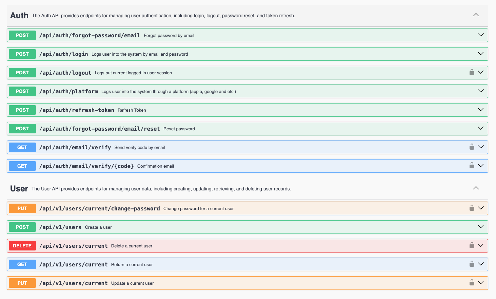

# Node.js Rest API

[](http://prettier.io) [](http://commitizen.github.io/cz-cli/) [](https://conventionalcommits.org)

This is a sample Node.js application comprehensive API including features such as user authentication, token refresh, user logout, password reset, and user management (creation, update, deletion).

Additionally, it supports authentication through various platforms including Facebook, Apple, Google, and Github. Twitter and LinkedIn are planned for future integration.

The project also includes a Swagger documentation.

## Features
  - Auth
    - [X] Authenticate user
    - [X] Email verify
    - [X] Implement "Forgot Password" via email
    - [ ] Implement "Forgot Password" via phone
    - [X] Logout a user
    - [X] Refresh token
    - [X] Implement "Reset Password" via email
    - [ ] Implement "Reset Password" via phone
  - User
    - [X] Create a new user
    - [X] Update user
    - [X] Reset password
    - [X] Delete user
  - Social Platform Integration
    - [ ] Linkedin
    - [ ] Twitter
    - [X] Apple
    - [X] Facebook
    - [X] Github
    - [X] Google
  - Testing
    - [X] Unit
    - [ ] E2E
    - [ ] Integration
  - [X] Implement Swagger for API documentation

## API Documentation

The REST API exposes its OpenAPI. You can view the API definition interactively using the Swagger UI, hosted at /docs. Simply start the server and navigate to [http://127.0.0.1:5858/docs](http://127.0.0.1:5858/docs) in your browser to access the Swagger UI.

Alternatively, you can explore the [online version of the API documentation](https://neverovski.github.io/nodejs-rest-api/) without running the server.

[](https://neverovski.github.io/nodejs-rest-api/)

## Installation

Development environment requirements:
- [Node.js](https://nodejs.org) >= 20
- [Docker](https://www.docker.com) >= 24
- [Docker Compose V2](https://docs.docker.com/compose/install/)

## Project initialization

### 1. [LOCAL] stage use docker-compose command
```sh
  cp .env.dev .env
  docker compose up -d --build
```

### 2. Migration
```sh
  npm run migrate:create --name=<NAME>
  npm run migrate:run
```

## Notes

### 1. Enable Git hooks

```sh
  npx husky install
  npx husky add .husky/commit-msg 'npm run commit-msg'
  npx husky add .husky/pre-commit 'npm run pre-commit'
```

### 2. Why is my git pre-commit hook not executable by default?

- Because files are not executable by default; they must be set to be executable.

```sh
  chmod ug+x .husky/*
  chmod ug+x .git/hooks/*
```

### 3. Git commit

```sh
  npm run commit
```

### 4. Project release

```sh
  npm run release:patch // Patch release 0.1.0 -> 0.1.1
  npm run release:minor // Minor release 0.1.1 -> 0.2.0
  npm run release:major // Major release 0.2.0 -> 1.0.0
```

### 5. Project Structure

| Name                       | Description                                             |
|----------------------------|---------------------------------------------------------|
| **src/**                   | Source files                                            |
| **src/common/**            | Modules shared across different parts of the project    |
| **src/common/constants/**  | Constant values used across the application             |
| **src/common/decorators/** | Decorators to enhance classes or class members          |
| **src/common/dtos/**       | Data Transfer Objects (DTOs) for data encapsulation     |
| **src/common/entities/**   | Classes defining the structure of database data         |
| **src/common/enums/**      | Enumeration types used across the application           |
| **src/common/exceptions/** | Exception classes for error handling                    |
| **src/common/interfaces/** | Interface definitions used throughout the application   |
| **src/common/schemas/**    | Schema definitions for data validation                  |
| **src/common/types/**      | Custom type definitions used in the application         |
| **src/common/utils/**      | Utility functions used across the application           |
| **src/config/**            | Configuration files                                     |
| **src/core/**              | Core application files                                  |
| **src/database/**          | Database connection, migration, seed, constraints, etc. |
| **src/i18n/**              | Internationalization files                              |
| **src/middleware/**        | Middleware for the application                          |
| **src/modules/**           | Application modules                                     |
| **src/providers/**         | Providers for the application                           |
| **templates/**             | Templates for the application                           |
| **build/**                 | Compiled source files                                   |
| **tests/**                 | Test cases                                              |
| **tests/e2e/**             | End-to-end test cases                                   |
| **tests/unit/**            | Unit test cases                                         |
| **tests/integration/**     | Integration test cases for API routes                   |

### 6. [Production Best Practices: Security](https://expressjs.com/en/advanced/best-practice-security.html)

- Don’t use deprecated or vulnerable versions of Express
- Use TLS
- Use Helmet
- Use cookies securely
- Prevent brute-force attacks against authorization
- Ensure your dependencies are secure
- Avoid other known vulnerabilities
- Additional considerations

## Contribution

Happy to get your feedback, but also you are feel free to raise a pull request.

## License

This project is licensed under the MIT. See the LICENSE.md file for details.
